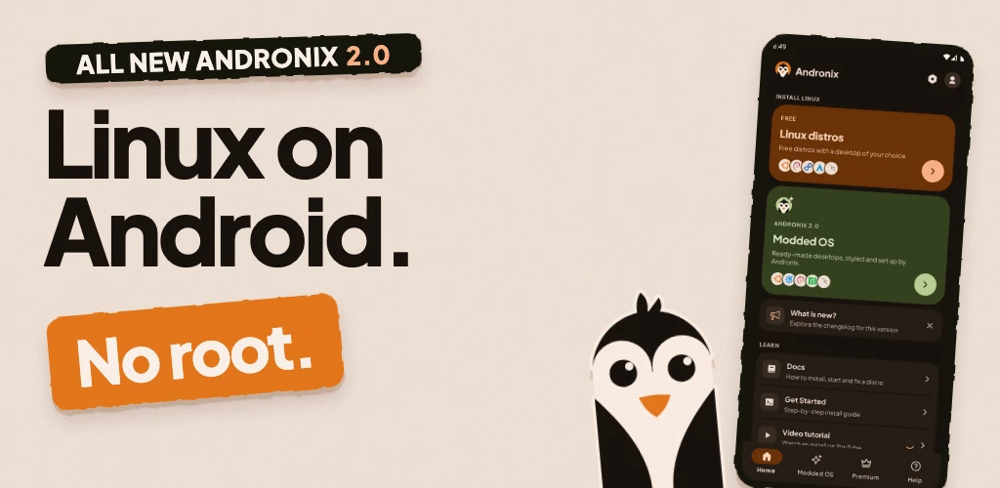
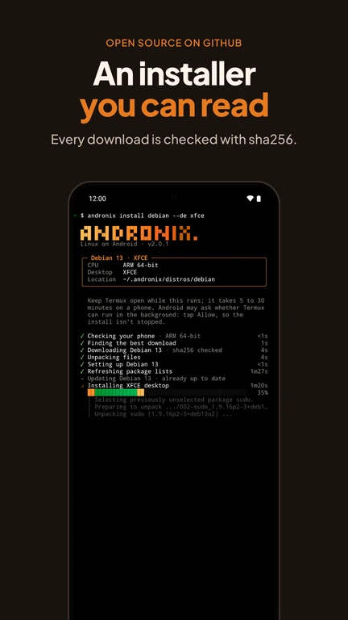
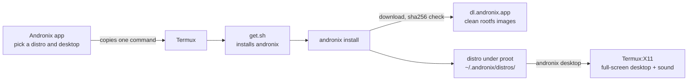

<p align="center">
  <a href="https://andronix.app">
    <picture>
      <source media="(prefers-color-scheme: dark)" srcset=".github/assets/hero-dark.webp">
      <source media="(prefers-color-scheme: light)" srcset=".github/assets/hero-light.webp">
      
    </picture>
  </a>
</p>

<p align="center">
  <b>Run Ubuntu, Debian, Kali, Fedora, Arch and more on your Android phone, with a full desktop. No root.</b>
</p>

<p align="center">
  <a href="https://play.google.com/store/apps/details?id=studio.com.techriz.andronix&utm_source=github&utm_medium=readme"></a>
  <a href="https://docs.andronix.app"></a>
  <a href="https://chat.andronix.app"></a>
  <br>
  <a href="https://github.com/AndronixApp/andronix/releases/latest"></a>
  <a href="LICENSE"></a>
</p>

<p align="center">
  <a href="#install">Install</a> ·
  <a href="#supported-distros">Distros</a> ·
  <a href="#desktops">Desktops</a> ·
  <a href="#commands">Commands</a> ·
  <a href="#how-it-works">How it works</a> ·
  <a href="#help">Help</a>
</p>

---

## Install

`andronix` installs and runs Linux distributions on Android, inside [Termux](https://termux.dev), with no root. It's the installer behind the [Andronix](https://andronix.app) app (app 10, Andronix 2.0), and you can use it on its own.

```sh
curl -fsSL https://dl.andronix.app/get.sh -o $PREFIX/tmp/get.sh && sh $PREFIX/tmp/get.sh install debian --de xfce
```

It works with Termux from F-Droid, GitHub and Google Play; Play Termux needs Android 11 or newer. The installer adds proot itself if it's missing, repairs a half-upgraded Termux, applies the fixes your phone needs, and checks every download against its sha256. If an install stops, run the same command again and it continues. The docs have [a version of the command that retries on a bad connection](https://docs.andronix.app/install/without-the-app).

<p align="center">
  
  &nbsp;
  
  &nbsp;
  <a href="https://youtu.be/TxVvNbqHk8U"></a>
</p>

Releases and notes: [Releases](https://github.com/AndronixApp/andronix/releases) and [CHANGELOG.md](CHANGELOG.md). Binaries are served from dl.andronix.app.

## Supported distros

All free. `andronix install <id> --de <desktop>` installs one.

| | Distro | Version | `id` | CPUs |
|:-:|---|---|---|---|
|  | Debian | 13 | `debian` | arm64, arm, x86, x86_64 |
|  | Ubuntu | 26.04 LTS | `ubuntu` | arm64, arm, x86_64 |
|  | Ubuntu | 24.04 LTS | `ubuntu24` | arm64, arm, x86_64 |
|  | Kali Linux | rolling | `kali` | arm64, arm, x86, x86_64 |
|  | Fedora | 44 | `fedora` | arm64, x86_64 |
|  | Arch Linux ARM | rolling | `arch` | arm64, arm, x86_64 |
|  | Manjaro ARM | stable | `manjaro` | arm64, x86_64 |
|  | Alpine | 3.24 | `alpine` | arm64, arm, x86, x86_64 |
|  | Void Linux | rolling | `void` | arm64, arm, x86, x86_64 |

Most phones are arm64. The installer checks your CPU first and tells you if a distro doesn't support it. Details, start scripts and package managers: [Supported distros](https://docs.andronix.app/reference/distros).

## Desktops

| Desktop | `--de` | Available on |
|---|---|---|
| **XFCE** (recommended) | `xfce` | every distro |
| **LXQt** | `lxqt` | every distro |
| **MATE** | `mate` | every distro |
| **KDE Plasma** | `kde` | Debian, Ubuntu 26.04 and Kali; needs 4 GB of RAM |
| Command line only | `none` | every distro |

Every desktop install comes with Firefox. Open it full screen with `andronix desktop` and the [Termux:X11 app](https://docs.andronix.app/desktop/termux-x11); sound plays through the phone's speakers. To use the desktop from another device, [VNC](https://docs.andronix.app/reference/vnc) works too.

<p align="center">
  
  <br>
  <sub>Debian 13 with XFCE, installed by <code>andronix</code></sub>
</p>

## Commands

```
andronix install <distro> [--de xfce|lxqt|mate|kde|none]
andronix start <distro> [-- command...]      ./start-<distro>.sh works too
andronix desktop <distro>                    the desktop in Termux:X11
andronix update [<distro>]                   the installer and your distros
andronix backup <distro> --to storage        andronix restore
andronix pack add <distro> python|node|java|go|db
andronix tune <distro> --profile light|balanced
andronix doctor                              what your phone supports, and the fixes applied
andronix report                              send us a problem report
andronix remove <distro>
andronix telemetry off|on|status
```

`andronix help` lists everything. Full reference: [the andronix command](https://docs.andronix.app/reference/andronix-command).

## Requirements

| | Command line only | With a desktop |
|---|---|---|
| **Android** | 7 or newer | 7 or newer |
| **Free storage** | about 0.5 GB | 1.5 to 2 GB (about 3 GB for KDE Plasma) |
| **RAM** | 2 GB | 3 GB or more is comfortable; 4 GB or more for KDE Plasma |
| **Root** | not needed | not needed |

- **Termux** from F-Droid, GitHub or Google Play. The Play build needs Android 11 or newer.
- **Android 12 and newer** can stop long-running apps (`Process completed (signal 9)`). [Turn that off once](https://docs.andronix.app/troubleshooting/signal-9).
- **Kernels older than 4.8** (many Android 8 and 9 phones): the command line works, but desktops stay black. The installer tells you.

More: [Requirements](https://docs.andronix.app/start-here/requirements) and [Limitations](https://docs.andronix.app/reference/limitations) (no Snap, Flatpak, Docker or GPU acceleration).

## How it works



- **The installer:** one Go binary per CPU (aarch64, arm, i686, x86_64), built with `GOOS=android` for Termux. A static Linux build of the same code runs inside each distro for the desktop and user setup.
- **Distros and desktops are data:** `distros/*.conf` and `desktops/*.conf` (plain `KEY=value`). The dev packs are data too, in `mods/packs/*.conf`.
- **Where the rootfs comes from:** clean tarballs on dl.andronix.app (`ci/build-rootfs.sh`, checked by `ci/check-image.sh`). If a tarball isn't there, the distro's official Docker image is used.
- **Running it:** each distro runs under proot, with fixes for Android kernels and seccomp. The installer measures what your phone's kernel and Termux can do and applies the fixes that phone needs; `andronix doctor` shows them.

[DESIGN.md](DESIGN.md) has the details, and [CHANGELOG.md](CHANGELOG.md) has the releases.

## Build and test

```sh
ci/build-go.sh                    # all binaries into dist/ (arm, i686 and x86_64 need the Android NDK or Docker)
NO_NDK=1 ci/build-go.sh           # quick: linux builds + android aarch64
go test ./...
tests/smoke.sh                    # end to end in a Termux-like Docker box (tests/Dockerfile)
tests/screens.sh debian xfce      # install a desktop and take screenshots
ci/build-rootfs.sh debian aarch64 # a clean rootfs tarball
```

The test box turns telemetry off (`ANDRONIX_NO_TELEMETRY=1`). `tests/emulator/` runs the installer inside the real Termux app on Android emulators.

## Privacy

`andronix` sends anonymous install events: distro, desktop, CPU, Android version, result, and a random id. It never sends names, emails, paths or commands. A notice shows the first time. Turn them off with `andronix telemetry off` or `ANDRONIX_NO_TELEMETRY=1`. The app's policy: [andronix.app/privacy](https://andronix.app/privacy).

## Modded editions

Andronix Modded OS 2.0 and the Classic editions are paid images, built and hosted separately, and sold in the [Andronix app](https://play.google.com/store/apps/details?id=studio.com.techriz.andronix&utm_source=github&utm_medium=readme). This repository has only the installer's side (`--edition`, `editions.conf`). See [Modded OS](https://docs.andronix.app/modded-os/modded-os).

## Andronix app 8.x

The installers of app 8.x and older are in [AndronixApp/AndronixOrigin](https://github.com/AndronixApp/AndronixOrigin/tree/master) (`master` branch), and they keep working. Docs: [app 8.x (Classic)](https://docs.andronix.app/v8) and [installs from before Andronix 2.0](https://docs.andronix.app/pre-2.0/older-installs).

## Contributing

- **Bugs:** [report a problem](https://docs.andronix.app/troubleshooting/report-a-problem) with `andronix report` or from the app, so we get your phone's details. GitHub issues are welcome too.
- **Code:** this repository is published from our development tree. Open an issue first for a change you'd like to make.

## Help

- Docs: [docs.andronix.app](https://docs.andronix.app) · [troubleshooting](https://docs.andronix.app/troubleshooting/install) · [FAQ](https://docs.andronix.app/troubleshooting/faq)
- Discord: [chat.andronix.app](https://chat.andronix.app)
- Website: [andronix.app](https://andronix.app)
- Email: support@andronix.app

## License

MIT, see [LICENSE](LICENSE). Each distro and package keeps its own license, and the distro logos belong to their projects.
